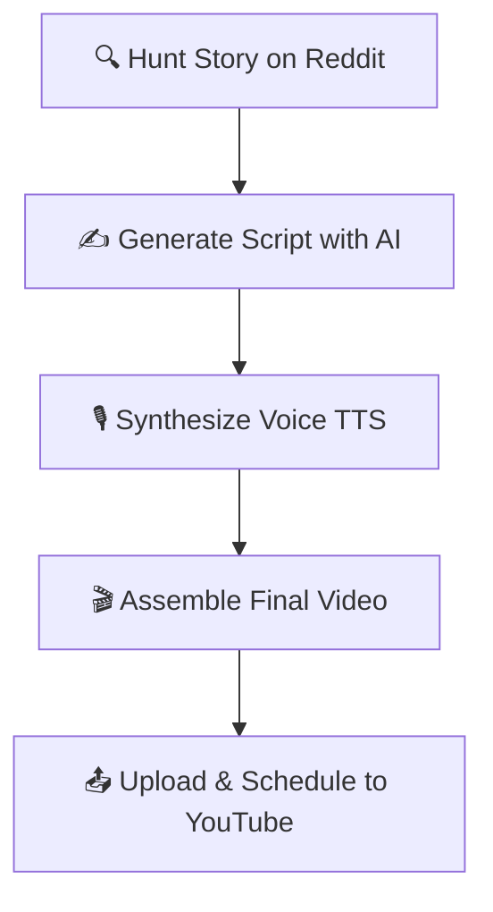

# Redishort 🤖 - Autonomous YouTube Shorts Creator


> ⚠️ **Project Status: Archived**
> This project was fully functional from June-August 2024 but is currently non-operational due to Reddit API policy changes. The codebase is preserved for portfolio demonstration and potential future adaptation.

---

## 📊 Real-World Results

This wasn't just a side project — **it worked in production**:

| Metric               | Value                                      |
| -------------------- | ------------------------------------------ |
| **Total Views**      | 200,000 - 300,000+                         |
| **Timeframe**        | 2 months                                   |
| **Platforms**        | YouTube, TikTok, Facebook, Instagram       |
| **Infrastructure**   | Self-hosted Docker on personal laptop      |
| **Automation Level** | 100% autonomous (content hunting → upload) |

### 🔗 Live Proof

**YouTube Channel**: [@reditoktv](https://www.youtube.com/@reditoktv)

All videos on this channel were generated and uploaded **completely autonomously** by this bot.

---

## 💼 Technical Highlights

This project demonstrates proficiency in:

| Category             | Technologies & Skills                                                          |
| -------------------- | ------------------------------------------------------------------------------ |
| **Python**           | Pydantic, Type Hints, Context Managers, Threading, Decorators                  |
| **APIs**             | Reddit API, YouTube Data API v3, Google Gemini, OpenAI Whisper                 |
| **AI/ML**            | LLM Integration (Gemini), Speech-to-Text (Whisper), Text-to-Speech (Coqui TTS) |
| **Video Processing** | MoviePy, FFmpeg, Dynamic Subtitles, Progress Bar Animation                     |
| **DevOps**           | Docker, Docker Compose, Environment Management                                 |
| **Architecture**     | Modular Design, Separation of Concerns, Resource Management                    |

---

## 🎯 What It Does

**Redishort** is an automation system that transforms viral Reddit stories into engaging YouTube Shorts videos. It manages the entire production pipeline autonomously:



### ✨ Key Features

| Feature                       | Description                                                      |
| ----------------------------- | ---------------------------------------------------------------- |
| 🧠 **Smart Content Hunting**  | Analyzes subreddit "temperature" to find high-potential stories  |
| 🎯 **Retention Optimization** | Word-by-word subtitles with karaoke effect and neon progress bar |
| 🗣️ **Dynamic Voices**         | Realistic voice cloning using Coqui TTS with gender variation    |
| 🐳 **Dockerized**             | Simple consistent deployment with one command                    |

---

## 🔧 What Would Need to Change (For Future Resumption)

The project stopped working due to **Reddit API restrictions** implemented in 2023. To resume:

| Component            | Current State           | Required Change                                                                                   |
| -------------------- | ----------------------- | ------------------------------------------------------------------------------------------------- |
| **Reddit Scraper**   | Uses PRAW (Reddit API)  | Switch to alternative: web scraping, or use different content sources (Twitter/X, news RSS, etc.) |
| **Story Validation** | Reddit-specific filters | Adapt to new content source format                                                                |
| **YouTube API**      | OAuth tokens expired    | Re-authenticate with fresh tokens                                                                 |

**Alternative Pivot Ideas:**

- Adapt for Twitter/X viral tweets
- Use news headlines as content source
- Integrate with content aggregators

---

## 📁 Project Structure

```
Redishort/
├── assets/
│   ├── fonts/
│   ├── voice_samples/
│   │   ├── male/
│   │   └── female/
│   ├── raw_videos/
│   ├── segments/
│   └── sessions/
├── prompts/
│   ├── full_script_prompt.txt
│   └── viral_descriptions_prompt.txt
├── config.py           # Central configuration
├── main.py             # Main orchestrator
├── reddit_scraper.py   # Reddit API interface
├── text_processor.py   # LLM script generation
├── tts_generator.py    # Text-to-speech
├── video_assembler.py  # Video composition
├── video_downloader.py # Background video download
├── video_segmenter.py  # Video processing
├── youtube_uploader.py # YouTube API upload
└── auth.py             # OAuth setup
```

---

## 🚀 Development Setup (For Reference)

<details>
<summary>Click to expand installation instructions</summary>

### Prerequisites

- Git
- Docker
- Docker Compose

### Installation

#### 1️⃣ Clone the Repository

```bash
git clone https://github.com/izan-co/Redishort.git
cd Redishort
```

#### 2️⃣ Configure Environment Variables

```bash
cp .env.example .env
```

> 💡 Open `.env` and fill in your credentials for Reddit and Google Gemini.

#### 3️⃣ Prepare Assets

- **Voice Samples**: Place `.wav` files in `assets/voice_samples/male/` and `assets/voice_samples/female/`
- **YouTube Credentials**: Download `client_secret.json` from Google Cloud Console

#### 4️⃣ YouTube Authorization

```bash
docker-compose run --rm redishort python auth.py
```

#### 5️⃣ Launch

```bash
docker-compose up --build -d
```

</details>

---

## ⚠️ Disclaimer

This project was created for **educational purposes** and personal task automation. Compliance with platform Terms of Service and content copyright is the user's responsibility.

---

<div align="center">

**Built by Izan Cano** • Summer 2024

[🔗 View Live Channel](https://www.youtube.com/@reditoktv)

</div>
